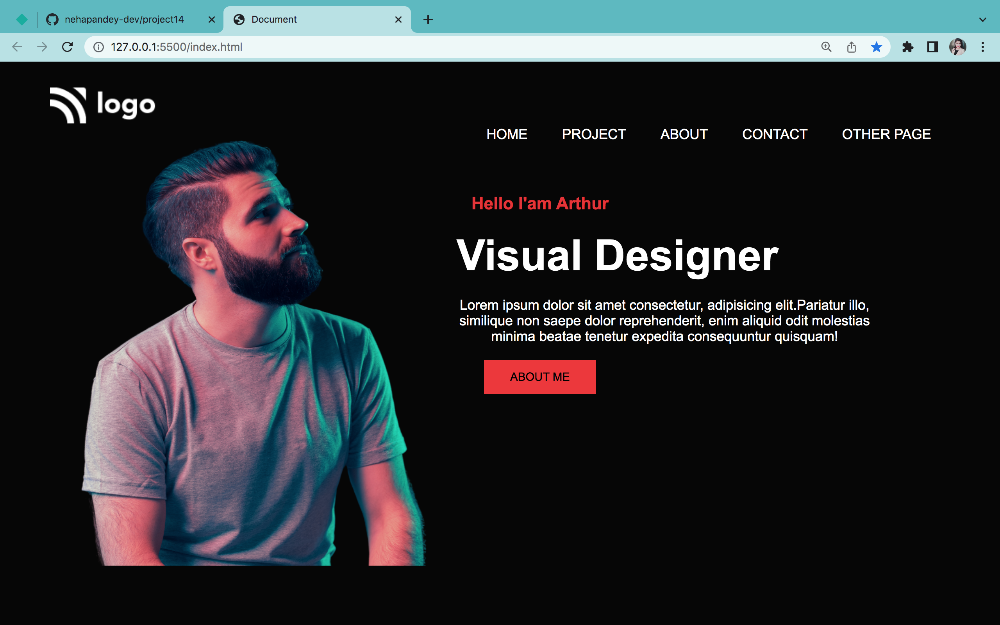

# Project 15
Hello there it's Neha Pandey.

### Project 15 is about product design landing page.

### Challenges

Since in this project ,I had to work on both HTML and CSS so there were lots of challenges for me like-
- mobile responsive for min width 300px to 700px
- flexbox properties (flex ,flex-direction and align- items , gap)
- justify-content (space-between , space around, space-evenly,center)
- backgrount color 
- position (absolute , relative)
- social media icons

### Total time to complete this project

It took me 7 hours to complete this project.

